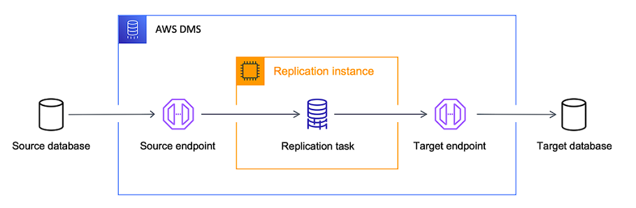

## Atividade de Kubernetes na Nuvem AWS
_Projeto de Kubernetes - Compass.UOL_

**Autores: Gabriel Faraco e Vitor Renk**

---

### Introdução

O projeto se baseia em uma arquitetura de um cliente fictício, onde temos que migrar a arquitetura atual para a Nuvem AWS, depois de migrada teremos que criar uma arquitetura nova e moderna baseada em Kubernetes.
O projeto é apenas teórico, onde teremos que detalhar de forma técnica todo o processo de migração e modernização.

---

### Índice

* [Escopo Detalhado (As-Is)](#escopo-detalhado-as-is)
* [Escopo Detalhado (Kubernetes)](#escopo-detalhado-modernização-kubernetes)

---

### Escopo Detalhado (As-Is)

#### Quais atividades são necessárias para a migração?

O processo de migração deverá passar por alguns processos até termos todo o conteúdo original replicado dentro da nuvem AWS e totalmente funcional, onde poderemos aposentar o servidor original _on-premise_:
* Replicação da aplicação dentro da nuvem AWS usando o **AWS MGN**.
* Replicação do Banco de Dados usando o **AWS DMS**.
* Testagem total dos componentes da aplicação, para averiguarmos total funcionamento independente do servidor original.
* Criação das instâncias de transição 100% funcionais.
* Criação de um Load Balancer e rotas com o serviço **Route 53** para migração completa do serviço, o que seria a parte final deste processo, já que esta etapa significa que o usuário do aplicativo do cliente tem acesso total a ele e o servidor original pode ser aposentado.
Cada passo descrito acima será melhor detalhado abaixo:

##### 1. Migração do App do Cliente para a Nuvem AWS

Esta parte do processo é a mais complexa desta etapa, por isso, separamos seus processos em passos separados abaixo:

###### 1a. Preparação do Ambiente de Migração

Dentro do ambiente AWS devemos criar uma sub-rede que será usada como a sub-rede de preparação, onde os dados replicados do servidor de origem serão mandados pelo agente replicador. 
Nesta etapa devemos configurar algumas portas:
* **TCP 443** - Esta porta será usada dentro da sub-rede de preparação para enviar dados do servidor de replicação para a API da **MGN** 
* **TCP 1500** - Esta porta deverá ser configurada no servidor de origem para mandar dados replicados de forma comprimida e criptografada (ponta-a-ponta via TLS 1.2) para o servidor de replicação, onde ele será descomprimido e descriptografado dentro desta sub-rede e depois escritas nos volumes respectivos.

###### 1b. Instalação e Configuração do Agente de Replicação

Primeiro passo da migração será instalar o agente de replicação do **AWS MGN** no servidor _on-premise_ para conectarmos os dados do servidor aos serviços da AWS e fazermos as migrações do servidor.
Devemos configurar no servidor original do cliente para liberar a porta *TCP 443* (HTTPS) para se comunicar com o serviço **MGN** da AWS, esta operação tem diversos propósitos: 
* Baixar o software necessário para se comunicar com a Nuvem AWS (O agente replicador).
* Atualizar agentes já instalados.
* Conectar os servidores conectados ao console da **MGN** e disponibilizar ao mesmo o estado de replicação. 
* Monitorar o servidor de origem para solução de problemas e métricas de consumo de recursos (uso de CPU, RAM, etc) 
* Reportar eventos relacionados ao servidor de origem (como remoção de algum disco ou formatação de disco).
* Transmitir informações relacionadas com o servidor de origem para o serviço de migração (incluindo informação de hardware, serviços rodando, pacotes e aplicações instaladas).
* Preparar o servidor de origem para teste e transição (_cutover_).

Depois de instalado o agente de replicação, devemos esperar pela sincronização completa entre o servidor de origem e o servidor de replicação. Feito isto, podemos seguir para as próximas etapas de testes e transição.

###### 1c. Etapas de Testes

Nesta etapa iremos criar instâncias em modo de teste, onde poderemos averiguar se os servidores replicados estão funcionando corretamente.
Antes desta etapa deveremos configurar os **Launch Templates** de cada servidor que replicamos e que desejamos testar, onde deveremos configurar o tamanho da máquina que queremos disponibilizar para cada servidor, qual sistema operacional usar, qual sub-rede esta **EC2** será lançada, quais **Security Groups**, quais tipos de volumes **EBS** e até mesmo algum arquivo extra de configuração inicial (**user_data.sh**).
Nesta parte deveremos criar dois **Launch Templates** distintos, um para a máquina que terá o React e outra que terá as Regras de Negócio.
Próxima etapa será o de fazer a migração do Banco de Dados para testarmos se a aplicação tem conexão total com o **MySQL**.

##### 2. Migração do Banco de Dados

Na parte do Banco de Dados precisaremos usar um serviço diferente, o **AWS DMS**, que fará toda replicação dos Bancos para o serviço de Banco de Dados da AWS, nesse caso o cliente necessita de uma replicação contínua de dados para manter a sincronia de origem e destino indefinidamente, mantendo seu destino sincronizado com uma origem transacionamente ativa, garantindo que os dados estejam em concomitância com o ambiente modernizado. 
Este serviço da AWS criará uma réplica usando o **AWS RDS** como o banco de destino final.
Esta parte é um pouco menos complicada que o processo anterior de migração da aplicação, temos que preparar uma sub-rede apenas para o Banco de Dados, que tenha como configuração de entrada e saída pela porta **TCP 3306** e acesso contínuo ao banco de dados original, como o Banco de Dados de origem também é um servidor **MySQL** não teremos nenhum problema de conversão na hora da replicação (o serviço de conversão da AWS é o **AWS SCT**, que não precisaremos usar neste projeto), já que o servidor de replicação também usará o **MySQL**.
Abaixo segue a imagem detalhada de como funciona processo de replicação de um banco de dados usando a **AWS DMS**:

##### 3. Final das Testagens e Criação de Instâncias de Integração

#### Quais as ferramentas vão ser utilizadas?

* **MGN**
* **DMS**
* **RDS**
* **EC2**
* **EBS**
* **Route 53**
* **ELB**
* **S3**
* **SSM**

#### 3. Qual o diagrama da infraestrutura na AWS?

#### 4. Como serão garantidos os requisitos de Segurança?
Para garantir a segurança da arquitetura de migração, deve-se utilizar o **AWS Application Migration Service (MGN)** assegurando que as conexões sejam feitas de maneira criptografada (TLS/SSL), transferindo os dados entre o ambiente de origem e a nuvem, protegendo-os contra interceptação. 

As permissões concedidas pelo **AWS MGN** são configuradas pelo **AWS IAM** para assegurar que somente os usuários ou roles autorizadas possuam o acesso. As regras de segurança Inbound e Outbound rules serão de acordo com a infraestrutura da migração, sendo a porta **TCP 443** como acesso direto a esses endpoint da API de serviço pelo protocolo HTTPS, e a porta **TCP 1500** como saída direta do servidor de origem para a sub-rede da área de preparo. A área de preparação possuíra acesso direto a esses endpoints da API de serviço pela porta **TCP 443** com entrada direta pela porta **TCP 1500**, garantindo assim boas práticas de seguranças durante a migração.

#### 5. Como será realizado o processo de Backup?
A Staging Area se comunica com o **Amazon S3** utilizando a porta **TCP 443** para proteger os dados em trânsito. Os dados transferidos são armazenados em um bucket **S3** com políticas de segurança, aceitando somente conexões seguras, sendo acessado restritamente pela Staging Area de administradores autorizados.

#### 6. Qual o custo da infraestrutura na AWS (AWS Calculator)?

---

### Escopo Detalhado (Modernização Kubernetes)

#### Quais atividades são necessárias para a migração?

#### Quais as ferramentas vão ser utilizadas?

#### Qual o diagrama da infraestrutura na AWS?

#### Como serão garantidos os requisitos de Segurança?

#### Como será realizado o processo de Backup?

#### Qual o custo da infraestrutura na AWS (AWS Calculator)?

---

### Referências

---
texto do vito
texto do Gabriel
