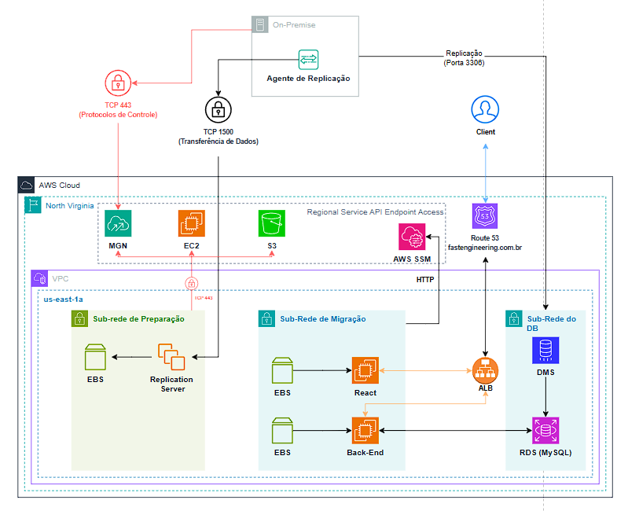
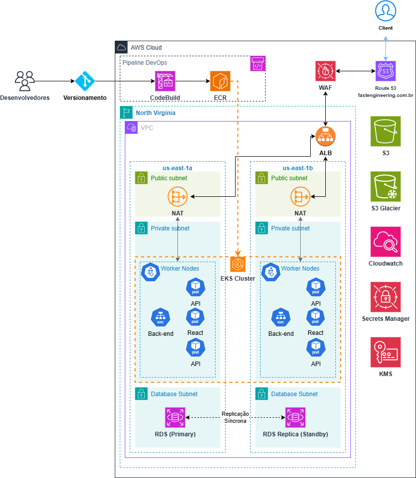

## Atividade de Kubernetes na Nuvem AWS
_Projeto de Kubernetes - Compass.UOL_

**Autores: Gabriel Faraco e Vitor Renk**

---

### Introdução

O projeto se baseia em uma arquitetura de um cliente fictício, onde temos que migrar a arquitetura atual para a Nuvem AWS, depois de migrada teremos que criar uma arquitetura nova e moderna baseada em Kubernetes.
O projeto é apenas teórico, onde teremos que detalhar de forma técnica todo o processo de migração e modernização.

---

### Índice

* [Escopo Detalhado (As-Is)](#escopo-detalhado-as-is)

* [Escopo Detalhado (Kubernetes)](#escopo-detalhado-modernização-kubernetes)

* [Referências](#referências)

---

### Escopo Detalhado (As-Is)

#### Quais atividades são necessárias para a migração?

O processo de migração deverá passar por alguns processos até termos todo o conteúdo original replicado dentro da nuvem AWS e totalmente funcional, onde poderemos aposentar o servidor original _on-premise_:
* Replicação da aplicação dentro da nuvem AWS usando o **AWS MGN**.
* Replicação do Banco de Dados usando o **AWS DMS**.
* Testagem total dos componentes da aplicação, para averiguarmos total funcionamento independente do servidor original.
* Criação das instâncias de transição 100% funcionais.
* Criação de um Load Balancer e rotas com o serviço **Route 53** para migração completa do serviço, o que seria a parte final deste processo, já que esta etapa significa que o usuário do aplicativo do cliente tem acesso total a ele e o servidor original pode ser aposentado.
Cada passo descrito acima será melhor detalhado abaixo:

##### 1. Migração do App do Cliente para a Nuvem AWS

A etapa de migração da aplicação precisa passar por alguns estágios até estar completa, como a imagem abaixo explica em uma forma compreensível:

Detalharemos melhor nas etapas a seguir.

###### 1a. Preparação do Ambiente de Migração

Dentro do ambiente AWS devemos criar uma sub-rede que será usada como a sub-rede de preparação, onde os dados replicados do servidor de origem serão mandados pelo agente replicador. 
Nesta etapa devemos configurar algumas portas:
* **TCP 443** - Esta porta será usada dentro da sub-rede de preparação para enviar dados do servidor de replicação para a API da **MGN** 
* **TCP 1500** - Esta porta deverá ser configurada no servidor de origem para mandar dados replicados de forma comprimida e criptografada (ponta-a-ponta via TLS 1.2) para o servidor de replicação, onde ele será descomprimido e descriptografado dentro desta sub-rede e depois escritas nos volumes respectivos.

###### 1b. Instalação e Configuração do Agente de Replicação

Primeiro passo da migração será instalar o agente de replicação do **AWS MGN** no servidor _on-premise_ para conectarmos os dados do servidor aos serviços da AWS e fazermos as migrações do servidor.
Devemos configurar no servidor original do cliente para liberar a porta **TCP 443** (HTTPS) para se comunicar com o serviço **MGN** da AWS, esta operação tem diversos propósitos: 
* Baixar o software necessário para se comunicar com a Nuvem AWS (O agente replicador).
* Atualizar agentes já instalados.
* Conectar os servidores conectados ao console da **MGN** e disponibilizar ao mesmo o estado de replicação. 
* Monitorar o servidor de origem para solução de problemas e métricas de consumo de recursos (uso de CPU, RAM, etc) 
* Reportar eventos relacionados ao servidor de origem (como remoção de algum disco ou formatação de disco).
* Transmitir informações relacionadas com o servidor de origem para o serviço de migração (incluindo informação de hardware, serviços rodando, pacotes e aplicações instaladas).
* Preparar o servidor de origem para teste e transição (_cutover_).

Depois de instalado o agente de replicação, devemos esperar pela sincronização completa entre o servidor de origem e o servidor de replicação. Feito isto, podemos seguir para as próximas etapas de testes e transição.

###### 1c. Etapas de Testes

Nesta etapa iremos criar instâncias em modo de teste, onde poderemos averiguar se os servidores replicados estão funcionando corretamente.
Antes desta etapa deveremos configurar os **Launch Templates** de cada servidor que replicamos e que desejamos testar, onde deveremos configurar o tamanho da máquina que queremos disponibilizar para cada servidor, qual sistema operacional usar, qual sub-rede esta **EC2** será lançada, quais **Security Groups**, quais tipos de volumes **EBS** e até mesmo algum arquivo extra de configuração inicial (**user_data.sh**).
Nesta parte deveremos criar dois **Launch Templates** distintos, um para a máquina que terá o React e outra que terá as Regras de Negócio.
Próxima etapa será o de fazer a migração do Banco de Dados para testarmos se a aplicação tem conexão total com o **MySQL**.

##### 2. Migração do Banco de Dados

Na parte do Banco de Dados precisaremos usar um serviço diferente, o **AWS DMS**, que fará toda replicação dos Bancos para o serviço de Banco de Dados da AWS, nesse caso o cliente necessita de uma replicação contínua de dados para manter a sincronia de origem e destino indefinidamente, mantendo seu destino sincronizado com uma origem transacionamente ativa, garantindo que os dados estejam em concomitância com o ambiente modernizado. 
Este serviço da AWS criará uma réplica usando o **AWS RDS** como o banco de destino final.
Esta parte é um pouco menos complicada que o processo anterior de migração da aplicação, temos que preparar uma sub-rede apenas para o Banco de Dados, que tenha como configuração de entrada e saída pela porta **TCP 3306** e acesso contínuo ao banco de dados original, como o Banco de Dados de origem também é um servidor **MySQL** não teremos nenhum problema de conversão na hora da replicação (o serviço de conversão da AWS é o **AWS SCT**, que não precisaremos usar neste projeto), já que o servidor de replicação também usará o **MySQL**.

Abaixo segue a imagem detalhada de como funciona processo de replicação de um banco de dados usando a **AWS DMS**:

##### 3. Final das Testagens e Criação de Instâncias de Integração

Agora que possuímos um banco de dados completamente independente do banco original, é hora de testarmos sua integração com as aplicações replicadas na nuvem. Ainda na parte de testes podemos conectar nossa instância de back-end ao **RDS** e testarmos conectividade, também podemos testar se a aplicação funciona de forma independente.
Após passado esse processo, podemos marcar as instâncias para _cutover_, onde iniciaremos o processo de integração.
O processo de integração é mais simples, somente precisaremos configurar as rotas de entrada da aplicação, pois no fim deste processo a migração estará completa e o **MGN** parará de replicar os dados do servidor original, o que significa que poderemos aposentar o servidor _on-premise_.

##### 4. Configuração das Rotas de Entrada e Load Balancer

Como o cliente já usa o **Route 53**, não precisaremos fazer muitas configurações, pois no final do processo de transição só precisaremos do Load Balancer configurado para se comunicar com o **Route 53**.
Nesta etapa do Load Balancer, criaremos um do tipo **Application Load Balancer**, que é a solução mais moderna da AWS para balanceamento de cargas de uma aplicação.
Para configurarmos o **ALB** precisaremos especificar um **Target Group**, registrar os objetos alvos, configurar o Load Balancer e um Listener e, por fim, testar o Load Balancer.
Feito isto, temos toda a arquitetura de integração e já podemos fazer os testes finais e aposentar o servidor de origem.

---

#### 2. Quais as ferramentas vão ser utilizadas?

* **MGN** - Serviço que facilita a migração de servidores e aplicações locais ou em outras nuvens para a infraestrutura da AWS, projeto para simplificar o processo de migração ao usar replicação contínua e reduzir o tempo de inatividade.

* **DMS** - Serviço para facilitar a migraçãode bancos de dados para a nuvem da AWS ou entre bancos de dados diferentes, utilizado para modernizar ambientes de dados, transferindo-os para bancos de dados gerenciados, como Amazon RDS.

* **RDS** - Serve para facilitar a configuração, operação e escalabilidade de bancos de dados relacionais na nuvem. Ele elimina grande parte do trabalho operacional envolvido  na manutenção de bancos de dados, como privisionamento de hardware, instalação de software, backup, recuperação e atualizações.

* **EC2** - Fornece servidores virtuais para hospedar aplicações e executar cargas de trabalho de forma escalável e flexível. 

* **EBS** - Serviço utilizado para armazenamento de blocos da AWS projetado para ser usado com instâncias EC2. Ele fornece volumes de armazenamento persistente que podem ser anexados a instâncias EC2, oferecendo desempenho de alto nível para cargas de trabalho como bancos de dados, sistemas de arquivos e aplicativos intensivos de dados.

* **Route 53** - Serviço DNS que oferece recursos de roteamento de tráfego, registro de domínios e verificação de integridade, projetado para alta disponibilidade e escalabilidade. Utilizado para gerenciar nomes de domínio e direcionar usuários finais para aplicações hospedadas na AWS ou fora dela.

* **ALB** - Solução para balanceamento de carga gerenciada pela AWS, projetada para operar na camada de aplicação (Camada 7 do modelo OSI). Ele distribui o tráfego HTTP/HTTPS de forma inteligente com base em regras avançadas, permitindo a criação de aplicações modernas e altamente escaláveis.

* **S3** - Serviço de armazenamento em nuvem altamente escalável, durável e seguro. Permite armazenar e recuperar qualquer quantidade de dados de qualquer lugar na internet.

* **SSM** - Ajuda a gerenciar e operar sua infraestrutura na nuvem e on-premises de forma centralizada. Fornece ferramentas para automação, controle de configuração, gerenciamento de patches, execução remota de comandos e coleta de logs, sendo amplamente utilizado para melhorar a segurança e a eficiência operacional.

---

#### 3. Qual o diagrama da infraestrutura na AWS?

---

#### 4. Como serão garantidos os requisitos de Segurança?

Para garantir a segurança da arquitetura de migração, deve-se utilizar o **AWS Application Migration Service (MGN)** assegurando que as conexões sejam feitas de maneira criptografada (TLS 1.2), transferindo os dados entre o ambiente de origem e a nuvem, protegendo-os contra interceptação. 

As permissões concedidas pelo **AWS MGN** são configuradas pelo **AWS IAM** para assegurar que somente os usuários ou roles autorizadas possuam o acesso. As regras de segurança Inbound e Outbound rules serão de acordo com a infraestrutura da migração, sendo a porta **TCP 443** como acesso direto a esses endpoint da API de serviço pelo protocolo HTTPS, e a porta **TCP 1500** como saída direta do servidor de origem para a sub-rede da área de preparo, esta porta usará o protocolo TLS 1.2, que criptografa ponta-a-ponta e compacta os dados do servidor de origem. A área de preparação possuíra acesso direto a esses endpoints da API de serviço pela porta **TCP 443** com entrada direta pela porta **TCP 1500**, garantindo assim boas práticas de seguranças durante a migração.

---

#### 5. Como será realizado o processo de Backup?

A Staging Area se comunica com o **Amazon S3** utilizando a porta **TCP 443** para proteger os dados em trânsito. Os dados transferidos são armazenados em um bucket **S3** com políticas de segurança, aceitando somente conexões seguras, sendo acessado restritamente pela Staging Area de administradores autorizados.

---

#### 6. Qual o custo da infraestrutura na AWS (AWS Calculator)?

Para a primeira etapa, referente a migração das aplicações e banco de dados, foi realizado uma estimativa dos custos com o **AWS Pricing Calculator** com todos os serviços incluídos no processo. 

Segue abaixo a tabela de custos da estimativa:

|Service           |Price (Monthly)    |Region          |
|------------------|-------------------|-----------------
|MGN               |$ 0,00             |North Virginia  |
|S3                |$ 1,04             |North Virginia  |
|EC2 (MGN)         |$ 42,47            |North Virginia  |
|EC2 (React)       |$ 16,18            |North Virginia  |
|EC2 (Back-end)    |$ 28,45            |North Virginia  |
|SSM               |$ 0,00             |North Virginia  |
|RDS               |$ 293,34           |North Virginia  |
|DMS               |$ 169,92           |North Virginia  |
|ALB               |$ 22,27            |North Virginia  |
|VPC               |$ 104,48           |North Virginia  |
|Route 53          |$ 3,60             |North Virginia  |
|**Total**            |**$ 681,76**

Esses valores se referem a um custo mensal, agora podemos calcular o valor mais aproximado do tempo estimado da migração, imaginamos que o processo de migração não durará mais que 7 dias, sendo assim, o valor de migração ficará em **$ 159,07**. 

---

### Escopo Detalhado (Modernização Kubernetes)

---

#### Quais atividades são necessárias para a modernização?

Para esta etapa precisaremos seguir alguns passos para completa modernização do sistema usando o Kubernetes:
* Criação de novas sub-redes para dividir logicamente a arquitetura (no modelo **three-tier**), alocação de novas Zonas de Disponibilidade, para termos uma estrutura mais resiliente.
* Conteinerização de cada parte da aplicação (**AWS ECR**) e implementação do **AWS EKS** como contexto Kubernetes dentro da Nuvem AWS.
* Criação de uma área específica para os desenvolvedores do aplicativo conseguirem seguir os _pipelines_ de _DevOps_ usando os serviços **AWS Code Commit**, **AWS Code Deploy** e o **AWS Code Build**.
* Implementação de uma melhor estrutura de monitoramento da aplicação usando o **AWS CloudWatch**.
* Implementação de um sistema mais robusto de segurança da informação usando o **AWS KMS**, o **Secrets Manager** e o **AWS WAF**.
* Replicação do Banco de Dados em outra Zonas de Disponibilidade e maior otimização para a arquitetura.
* **Parte Opcional** - Replicar a mesma arquitetura em outra Região AWS como redundância de prevenção a desastres.

Cada passo descrito acima será melhor detalhado abaixo:

#### 1. Criação de Novas Sub-Redes e AZs

Baseada na arquitetura anterior de migração, podemos reutilizar algumas partes já criadas anteriormente, como as duas sub-redes privadas e uma pública, só teremos que criar mais uma Zona de Disponibilidade dentro da Região da Virgínia do Norte e cada sub-rede respectiva, respeitando o modelo **three-tier**.

#### 2. Conteinerização das Aplicações e Implementação de Pipeline DevOps

A etapa de conteinerização é fundamental para a modernização da aplicação dentro da Nuvem AWS, precisamos converter as APIs de máquinas físicas para máquinas conteinerizadas, facilitando o desenvolvimento e integração usando o **Kubernetes**. Para tal, usaremos algumas tecnologias e ferramentas dentro da AWS e também fora dela, como o Docker.
Antes deste processo precisaremos criar uma área dentro da nuvem focada nos Pipelines DevOps (**AWS Code Pipeline**), uma área separada para desenvolvimentos e testes antes da implantação de modificações da aplicação em produção. Isto irá facilitar o trabalho dos desenvolvedores para criar contêineres e implantá-los no contexto **Kubernetes**.
Detalharemos estes processos melhor nas etapas a seguir.

###### 2a. Criação da Área de Pipeline

Antes de modificarmos a arquitetura atual, pós migração, temos que criar um ambiente de desenvolvimento e testagem, pois não poderemos simplesmente introduzir uma mudança drástica na arquitetura com um ambiente já em produção. 
Abaixo detalharemos brevemente cada processo do pipeline, como mostra a imagem:

* **Fonte** - Esta é a primeira fase, precisamos vincular o repositório da aplicação e cada modificação neste repositório irá acionar o Pipeline.
* **Construção** - Nesta fase o código é compilado e os artefatos são produzidos, nesta fase também usaremos o **AWS Code Build** para auxiliar. Na arquitetura atual usaremos esta fase para conteinerizar as partes das aplicações, que usaremos posteriormente no **AWS EKS**, teremos auxílio do **AWS ECR**.
* **Testagem** - Esta é a etapa de testes e testes unitários, onde as partes da aplicação são testadas para garantir total funcionabilidade, ainda usaremos o **AWS Code Build** nesta etapa.
* **Preparação** - Nesta fase a aplicação é testada num ambiente que simula o ambiente de produção.
* **Produção** - Esta é a fase final, onde os usuários do sistema podem interagir com as mudanças dentro da aplicação. Antes desta etapa, teremos que configurar o serviço **EKS** da AWS, que cuidará e gerenciará dos Nodes Kubernetes onde ficarão as APIs da aplicação.

###### 2b. Configuração do AWS EKS

Com a implementação da área de **Pipeline**, conseguimos integrar a equipe de desenvolvimento diretamente ao **EKS** Cluster, que opera dentro da VPC. O **EKS (Elastic Kubernetes Service)** é uma solução gerenciada pela AWS para orquestração de contêineres com Kubernetes. Ele simplifica a configuração, o gerenciamento e a escalabilidade dos clusters, automatizando processos e permitindo que a equipe se concentre no desenvolvimento e na operação das aplicações.

O tráfego do cliente é direcionado inicialmente pelo **Route 53**, que encaminha as requisições para a arquitetura. O tráfego passa então pelo **WAF (Web Application Firewall)**, que oferece uma camada adicional de proteção para as aplicações, funcionando como um firewall. Em seguida, a conexão é distribuída de forma eficiente pelo **ALB (Application Load Balancer)**, que roteia o tráfego de entrada e o direciona com segurança, em conjunto com o NAT Gateway para os **Worker Nodes**, que estão alocados dentro das subnets privadas.

Dentro do **EKS Cluster**, alocamos duas zonas de disponibilidade (AZs), cada uma com suas respectivas subnets públicas e privadas. As subnets públicas hospedam os **NAT Gateways**, responsáveis pela distribuição do tráfego para os **Worker Nodes**, onde os Pods executam os contêineres que hospedam as aplicações do cluster.

#### 3. Criação de Réplica para o RDS

Uma boa prática desta nossa arquitetura será a replicação do Banco de Dados, para fazer isto precisaremos colocar uma **RDS** em outra **AZ** dentro da região que estamos criando a arquitetura. 
Esta **RDS** possuirá conexão síncrona com o Banco de Dados original, se por ventura ocorrer alguma falha na **AZ**, este banco deixará de ficar em _standby_ imediatamente, até que o banco principal volta novamente a funcionar.

---

#### Quais as ferramentas vão ser utilizadas?

Ainda continuaremos usando algumas ferramentas usadas no processo de migração, como o **EC2**, **Route 53**, **S3**, **EBS**, **ALB** e **RDS**, mais algumas tecnologias novas:

**AWS Code Pipeline** - É um serviço de integração e entrega contínuas (CI/CD) que automatiza os processos de build, teste e implantação do seu código. Permite criar pipelines para gerenciar o fluxo de trabalho completo de entrega de software, desde o commit no repositório até a produção.

**AWS Code Build** - Serviço gerenciado pelo CI/CD que compila o código-fonte, executa testes e produz pacotes de software prontos para implantação. Ele é usado frequentemente em conjunto com o AWS CodePipeline, mas pode ser usado separadamente para tarefas específicas de build.

**AWS ECR** - Serviço de registro de contêiner gerenciado, altamente disponível e seguro da AWS. Ele é usado para armazenar, gerenciar e implantar imagens de contêiner, integrando-se facilmente com pipelines de CI/CD.

**AWS EKS** - É um serviço gerenciado de Kubernetes que facilita a implantação, gerenciamento e escalabilidade de aplicações em contêineres, eliminando a necessidade de configurar manualmente cluster Kubernetes, garantindo alta disponibilidade e integração com outros serviços AWS. 

**Secrets Manager** - Gerencia segredos, como credenciais de banco de dados, chaves de API e outros dados sensíveis. Ele oferece armazenamento seguro, rotação automática, integração com serviços da AWS e acesso programático aos segredos.

**AWS KMS** - Cria, gerencia e protege chaves de criptografia usadas para proteger seus dados. Altamente integrado com outros serviços da AWS, permite o uso de criptografia simétrica e assimétrica, além de fornecer controle detalhado de permissões.

**CloudWatch** - Serviço de monitoramento da AWS que coleta e analisa métricas, logs e eventos de recursos e aplicações em execução na AWS e on-premises. Ajuda a identificar problemas, configurar alertas e melhorar a visibilidade operacional.

**AWS WAF** - Ajuda a proteger aplicações web contra ameaças comuns e exploração de vulnerabilidades conhecidas. Ele funciona filtrando tráfego malicioso antes de atingir suas aplicações, com base em regras personalizáveis.

---

#### Qual o diagrama da infraestrutura na AWS?

---

#### Como serão garantidos os requisitos de Segurança?

A conexão do cliente é inicialmente estabelecida através do **Route 53**, que oferece proteção contra ataques distribuídos de negação de serviço (DDoS). Em seguida, a conexão é direcionada para o **WAF (Web Application Firewall)**, onde são aplicadas regras de segurança configuradas para permitir ou bloquear solicitações com base em padrões de tráfego definidos. Essas regras personalizáveis podem ser ajustadas para inspecionar as solicitações HTTPS. O **WAF** está integrado ao **Application Load Balancer (ALB)**, que gerencia o acesso às aplicações por meio da porta 443 (HTTPS), utilizando o protocolo TLS 1.3. Este protocolo criptografa os dados trocados entre cliente e servidor, impedindo que terceiros interceptem ou leiam as informações. Além disso, o **ALB** adiciona camadas extras de segurança no nível da sub-rede, restringindo o tráfego e garantindo a proteção adicional.

Dentro do **EKS Cluster** na **VPC**, os recursos são acessados através do NAT Gateway, alocado nas subnets públicas. O **NAT Gateway** funciona como uma ponte de conexão, garantindo que as aplicações não sejam expostas diretamente à internet. Para reforçar a segurança, é essencial configurar um Security Group que bloqueie acessos diretos ao **NAT Gateway**, garantindo que ele apenas atue como proxy para o tráfego de saída, sem ser acessível diretamente.

Em relação à segurança do **EKS**, é fundamental verificar a configuração de rede para restringir o tráfego entre os pods. Isso assegura que apenas pods autorizados possam se comunicar entre si, mantendo o tráfego controlado. A política de **IAM (Identity and Access Management)** deve ser implementada com o princípio do mínimo privilégio, garantindo que cada recurso tenha acesso apenas às permissões necessárias para suas operações.

A integração do **AWS Secrets Manager** e do **AWS KMS** com o **EKS** oferece uma abordagem segura e eficiente para o gerenciamento de credenciais sensíveis e dados criptografados no ambiente **Kubernetes**. A chave para a segurança dessa integração é adotar políticas de acesso baseadas no princípio de mínimos privilégios, utilizar **IAM Roles for Service Accounts (IRSA)** para um controle de acesso granular e monitorar constantemente o uso de segredos e chaves criptográficas, garantindo que o acesso seja adequado e seguro.

Para o **Amazon RDS** e suas réplicas, é fundamental aplicar boas práticas de segurança, configurando **Security Groups** para controlar o tráfego de entrada e saída. A comunicação interna entre a instância principal e as réplicas deve ser restrita ao tráfego da **VPC** e fontes confiáveis. Além disso, é importante habilitar a criptografia em repouso no RDS, utilizando chaves gerenciadas pelo **AWS KMS**, o que assegura a proteção dos dados de leitura e gravação. A replicação síncrona garante que as réplicas estejam sempre em sincronia com a instância principal, mantendo a consistência dos dados. Contudo, é essencial configurar o SSL/TLS para proteger os dados sensíveis durante a replicação, prevenindo que informações críticas sejam expostas.

A segurança dessa arquitetura deve ser construída com múltiplas camadas, incluindo boas práticas de configuração de rede, controle de acesso, criptografia e monitoramento contínuo. Ao integrar o **NAT Gateway**, **ALB**, **EKS** e outras camadas de segurança, cria-se uma defesa em profundidade, garantindo que os dados e recursos da infraestrutura estejam protegidos contra ameaças externas e internas.

---

#### Como será realizado o processo de Backup?

O processo de backup será garantido com o uso do **Amazon S3**, aproveitando recursos avançados para proteção e recuperação de dados. O primeiro passo é ativar o versionamento no bucket, permitindo o armazenamento de todas as versões de um objeto, mesmo que ele seja sobrescrito ou excluído. Isso assegura que versões anteriores estejam sempre disponíveis. Além disso, o **S3** oferece a replicação entre buckets, tanto na mesma região quanto em outra, aumentando a resiliência e a capacidade de recuperação em casos de desastres.

No caso do **EKS Cluster**, o backup será automatizado com base nas pré-configurações estabelecidas. Por exemplo, o uso de **Auto Scaling Groups** permite a substituição automática de worker nodes em caso de falhas. Ferramentas como eksctl ou o **AWS Management Console** serão utilizadas para exportar as configurações do cluster, incluindo arquivos YAML, deployments, configmaps e ingress. Isso facilita a restauração e a manutenção da infraestrutura.

O **CloudWatch** será utilizado para armazenar logs de auditoria e operacionais, garantindo que esses dados estejam seguros e acessíveis durante a execução das aplicações. Essa prática melhora a rastreabilidade e assegura conformidade operacional.

Para o banco de dados **Amazon RDS (MySQL)**, será configurada uma ou mais réplicas em diferentes zonas de disponibilidade (AZs) para oferecer redundância e suporte a failover. A replicação será feita de forma síncrona, o que significa que os dados serão copiados para a réplica antes de confirmar a transação na instância primária. Além disso, em uma arquitetura que abrange múltiplas regiões, será possível configurar a replicação entre regiões usando **Read Replicas Cross-Region**, garantindo alta disponibilidade mesmo em cenários de desastre global (opcional).

---

#### Qual o custo da infraestrutura na AWS (AWS Calculator)?

Para a segunda etapa, referente a modernização com o ambiente **EKS** incluso, também foi realizado a estimativa de custos com o **AWS Pricing Calculator**. Nessa parte foi criado a estimativa tanto para a região North Virginia quanto para a de Ohio, com o objetivo de mostrar diferentes escolhas com uma arquitetura de Multi-Regiões ao cliente.

Segue abaixo a tabela de custos da estimativa da região North Virginia:

|Service           |Price (Monthly)    |Region          |
|------------------|-------------------|----------------|
|RDS               |$ 293,34           |North Virginia  |
|RDS (Réplica)     |$ 293,34           |North Virginia  |
|Route 53          |$ 3,60             |North Virginia  |
|ALB               |$ 22,27            |North Virginia  |
|WAF               |$ 25,00            |North Virginia  |
|S3                |$ 2,91             |North Virginia  |
|CloudWatch        |$ 16,08            |North Virginia  |
|Secrets Manager   |$ 4,00             |North Virginia  |
|KMS               |$ 11,00            |North Virginia  |
|EKS Cluster       |$ 73,00            |North Virginia  |
|VPC               |$ 154,20           |North Virginia  |
|EC2 (Worker Nodes)|$ 103,95           |North Virginia  |
|**Total**             |**$ 1,002.69**           

Valor total da modernização Single-Region = $ 898,74

Segue abaixo a tabela de custos da estimativa da região Ohio:

|Service           |Price (Monthly)    |Region          |
|------------------|-------------------|----------------|
|RDS               |$ 293,34           |Ohio            |
|RDS (Réplica)     |$ 293,34           |Ohio            |
|ALB               |$ 22,27            |Ohio            |
|WAF               |$ 25,00            |Ohio            |
|S3                |$ 2,91             |Ohio            |
|CloudWatch        |$ 16,08            |Ohio            |
|Secrets Manager   |$ 4,00             |Ohio            |
|KMS               |$ 11,00            |Ohio            |
|EKS Cluster       |$ 73,00            |Ohio            |
|VPC               |$ 154,20           |Ohio            |
|EC2 (Worker Nodes)|$ 103,95           |Ohio  |
|**Total**             |**$ 999.09**

Para o modelo de Multi-Region, somamos o custo mensal das duas regiões para uma infraestrutura com uma alta disponibilidade e resiliência das aplicações, reduzindo a sobrecarga de cada região, otimizando a utilização de recursos.

Valor total da modernização Multi-Region = **$ 2.001,78**

---

### Conclusão

Este projeto foi bastante útil para aprendermos novas tecnologias dentro da Nuvem AWS, como o **AWS EKS** ou o **Code Pipeline**, por mais que o projeto tenha sido mais teórico do que prático, não deixou de ser um ótimo conhecimento que agregamos.
Tivemos que estudar bastante pra entender como migrar uma arquitetura _on-premise_ para a Nuvem AWS e depois definir os processos de modernização da mesma usando o **Kubernetes**.
Uma das partes mais interessantes deste projeto foi o trabalho em equipe que tivemos, usamos ferramentas em conjunto como o git e o draw.io e tivemos uma boa coesão como dupla.
Gostaríamos de agradecer a Compass.UOL pela oportunidade que nos deram neste estágio, pelo tanto que já aprendemos ao longo desta jornada.

---

### Referências

[Documentação da AWS MGN](https://docs.aws.amazon.com/mgn/latest/ug/what-is-application-migration-service.html)

[Documentação da AWS DMS](https://docs.aws.amazon.com/dms/latest/userguide/Welcome.html)

[Documentação do AWS EKS](https://docs.aws.amazon.com/eks/latest/userguide/getting-started.html)

[Documentação da AWS Code Pipeline](https://docs.aws.amazon.com/codepipeline/)

---
